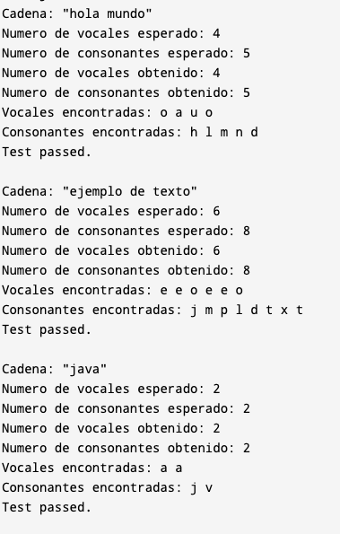

# Examen-1-Parcial: Java 

## Puntos a evaluar:
### 1.Analisis: 10%
### 2.Implementación(estructura del código, orden, sin errores de sintaxis): 10%
### 3.Pruebas 10%: Probar en los siguientes casos:

Disenar un programa que cuente las vocales y las consonantes de una cadena de texto.

Tener en cuenta los metodos para cadenas de String
```Java
   //Convertir a minusculas
   cadena.length()
   //convertir a minusculas
   cadena.toLowerCase();
```

 
```java
 public class ContarVocalesYConsonantes {

    public static int[] contarVocalesYConsonantes(String cadena) {
        int contadorVocales = 0;
        int contadorConsonantes = 0;
        String vocales = "aeiouAEIOU";
      
        /* Escribe tu codigo aqui */

         /*Aqui termina tu codigo */
        return new int[]{contadorVocales, contadorConsonantes}; 
    }

    public static void testContarVocalesYConsonantes(String cadena, int resultadoEsperadoVocales, int resultadoEsperadoConsonantes) {
        int[] resultadoObtenido = contarVocalesYConsonantes(cadena);
        String vocalesEncontradas = "";
        String consonantesEncontradas = "";
        
        cadena = cadena.toLowerCase();
        for (int i = 0; i < cadena.length(); i++) {
            char c = cadena.charAt(i);
            if (c == 'a' || c == 'e' || c == 'i' || c == 'o' || c == 'u') {
                vocalesEncontradas += c + " ";
            } else if (Character.isLetter(c)) {
                consonantesEncontradas += c + " ";
            }
        }

        System.out.println("Cadena: \"" + cadena + "\"");
        System.out.println("Numero de vocales esperado: " + resultadoEsperadoVocales);
        System.out.println("Numero de consonantes esperado: " + resultadoEsperadoConsonantes);
        System.out.println("Numero de vocales obtenido: " + resultadoObtenido[0]);
        System.out.println("Numero de consonantes obtenido: " + resultadoObtenido[1]);
        System.out.println("Vocales encontradas: " + vocalesEncontradas.trim());
        System.out.println("Consonantes encontradas: " + consonantesEncontradas.trim());

        if (resultadoObtenido[0] == resultadoEsperadoVocales && resultadoObtenido[1] == resultadoEsperadoConsonantes) {
            System.out.println("Test passed.");
        } else {
            System.out.println("Test case not passed.");
        }
        System.out.println();
    }

    public static void main(String[] args) {
        System.out.println("--- Ejecutando tests ---");
        testContarVocalesYConsonantes("Hola Mundo", 4, 5);      
        testContarVocalesYConsonantes("Ejemplo de texto", 6, 8);
        testContarVocalesYConsonantes("JAVA", 2, 2);            
    }
}
```
La salida del programa debe de ser:


